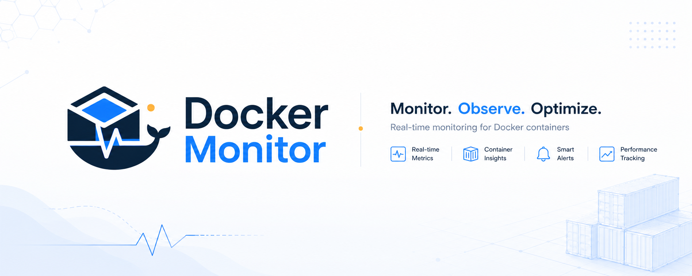

<div align="center">



# Docker Monitor

### Monitoramento simples e centralizado de containers Docker com Java

[](#status-do-projeto)
[](https://www.java.com/)
[](https://www.docker.com/)
[](#licença)

</div>

---

## Sobre o projeto

O **Docker Monitor** é uma aplicação em Java criada para acompanhar o estado, o consumo de recursos e a disponibilidade de containers Docker.

O objetivo do projeto é oferecer uma interface simples para visualizar informações operacionais do ambiente Docker, facilitando a identificação de falhas, interrupções e consumo excessivo de recursos.

> [!WARNING]
> Este projeto está em **W.I.P. — Work in Progress**.
>
> Funcionalidades, arquitetura, documentação e interfaces ainda podem sofrer alterações significativas.

## Status do projeto

🚧 **Em desenvolvimento ativo**

O projeto ainda não possui uma versão estável para ambientes de produção.

Nesta fase, o foco está na construção da base da aplicação, integração com o Docker Engine e definição dos principais fluxos de monitoramento.

## Objetivos

* Listar containers disponíveis no ambiente Docker.
* Exibir o estado atual de cada container.
* Acompanhar uso de CPU e memória.
* Consultar informações básicas de execução.
* Identificar containers interrompidos ou com falhas.
* Centralizar métricas essenciais em uma única interface.
* Implementar alertas e eventos de monitoramento.
* Manter uma arquitetura simples, modular e extensível.

## Funcionalidades planejadas

* [ ] Listagem de containers.
* [ ] Visualização de containers ativos e inativos.
* [ ] Monitoramento de CPU.
* [ ] Monitoramento de memória.
* [ ] Informações de rede.
* [ ] Informações de armazenamento.
* [ ] Consulta de logs.
* [ ] Inicialização de containers.
* [ ] Interrupção de containers.
* [ ] Reinicialização de containers.
* [ ] Histórico de eventos.
* [ ] Alertas configuráveis.
* [ ] Dashboard de métricas.
* [ ] Autenticação de usuários.
* [ ] Suporte a múltiplos hosts Docker.
* [ ] Documentação da API.
* [ ] Testes automatizados.

## Tecnologias

O projeto está sendo desenvolvido com tecnologias do ecossistema Java e Docker.

* Java
* Docker Engine API
* Maven ou Gradle
* Spring Boot
* REST API
* Docker
* Docker Compose

> A stack poderá ser ajustada durante o desenvolvimento.

## Arquitetura prevista

```text
Docker Monitor
├── API
│   ├── Containers
│   ├── Metrics
│   ├── Logs
│   └── Events
├── Application
│   ├── Services
│   └── Use Cases
├── Domain
│   ├── Models
│   └── Interfaces
├── Infrastructure
│   ├── Docker Client
│   ├── Persistence
│   └── Configuration
└── Tests
```

A aplicação deverá se comunicar com o Docker Engine para consultar containers, métricas, logs e eventos.

```text
Client
   │
   ▼
Docker Monitor API
   │
   ▼
Docker Engine API
   │
   ▼
Containers
```

## Pré-requisitos

Antes de executar o projeto, será necessário ter instalado:

* Java 21 ou superior.
* Docker Engine.
* Docker Compose.
* Maven ou Gradle.
* Git.

Verifique as instalações:

```bash
java --version
docker --version
docker compose version
git --version
```

## Instalação

Clone o repositório:

```bash
git clone https://github.com/SEU-USUARIO/docker-monitor.git
```

Acesse o diretório:

```bash
cd docker-monitor
```

### Usando Maven

```bash
./mvnw clean install
```

Execute a aplicação:

```bash
./mvnw spring-boot:run
```

### Usando Gradle

```bash
./gradlew build
```

Execute a aplicação:

```bash
./gradlew bootRun
```

> Utilize apenas o gerenciador de dependências configurado no repositório.

## Configuração

Crie o arquivo de configuração local com base no exemplo disponibilizado pelo projeto.

```bash
cp .env.example .env
```

Exemplo inicial:

```env
APP_NAME=Docker Monitor
APP_ENV=development
APP_PORT=8080

DOCKER_HOST=unix:///var/run/docker.sock
```

Em ambientes Windows, o endereço do Docker Engine poderá ser diferente.

Exemplo:

```env
DOCKER_HOST=npipe:////./pipe/docker_engine
```

> Nunca publique credenciais, tokens ou configurações sensíveis no repositório.

## Executando com Docker

Quando o ambiente Docker Compose estiver disponível, a aplicação poderá ser iniciada com:

```bash
docker compose up -d --build
```

Acompanhe os logs:

```bash
docker compose logs -f
```

Finalize os serviços:

```bash
docker compose down
```

## Acesso ao Docker Socket

Em sistemas Linux, a aplicação poderá precisar acessar o socket do Docker:

```text
/var/run/docker.sock
```

Exemplo de volume em um arquivo `compose.yaml`:

```yaml
services:
  docker-monitor:
    build:
      context: .
    ports:
      - "8080:8080"
    volumes:
      - /var/run/docker.sock:/var/run/docker.sock
```

> [!CAUTION]
> O acesso ao Docker Socket concede privilégios elevados sobre o host.
>
> Essa integração deve ser configurada com atenção, principalmente em ambientes de produção.

## Endpoints planejados

| Método | Endpoint                       | Descrição               |
| ------ | ------------------------------ | ----------------------- |
| `GET`  | `/api/containers`              | Lista os containers     |
| `GET`  | `/api/containers/{id}`         | Exibe um container      |
| `GET`  | `/api/containers/{id}/stats`   | Consulta métricas       |
| `GET`  | `/api/containers/{id}/logs`    | Consulta logs           |
| `POST` | `/api/containers/{id}/start`   | Inicia um container     |
| `POST` | `/api/containers/{id}/stop`    | Interrompe um container |
| `POST` | `/api/containers/{id}/restart` | Reinicia um container   |
| `GET`  | `/api/events`                  | Lista eventos do Docker |

Os endpoints ainda poderão ser alterados durante o desenvolvimento.

## Testes

### Maven

```bash
./mvnw test
```

### Gradle

```bash
./gradlew test
```

## Roadmap

### Fase 1 — Fundação

* Estrutura inicial do projeto.
* Configuração da aplicação.
* Integração com o Docker Engine.
* Padronização de respostas da API.
* Tratamento inicial de erros.

### Fase 2 — Containers

* Listagem de containers.
* Exibição de detalhes.
* Inicialização, interrupção e reinicialização.
* Consulta de logs.

### Fase 3 — Monitoramento

* Coleta de CPU.
* Coleta de memória.
* Métricas de rede.
* Métricas de armazenamento.
* Histórico de métricas.

### Fase 4 — Interface

* Dashboard principal.
* Página de detalhes do container.
* Indicadores de disponibilidade.
* Visualização de métricas.
* Alertas visuais.

### Fase 5 — Produção

* Autenticação.
* Controle de permissões.
* Observabilidade da aplicação.
* Testes de integração.
* Documentação da API.
* Pipeline de CI/CD.

## Como contribuir

Como o projeto ainda está em desenvolvimento inicial, o fluxo de contribuição poderá sofrer alterações.

1. Faça um fork do repositório.
2. Crie uma branch para sua alteração.

```bash
git checkout -b feature/container-metrics
```

3. Faça suas alterações.
4. Execute os testes.
5. Crie um commit descritivo.

```bash
git commit -m "feat: add container metrics endpoint"
```

6. Envie a branch.

```bash
git push origin feature/container-metrics
```

7. Abra um Pull Request.

## Padrão de commits

O projeto pretende utilizar o padrão Conventional Commits.

```text
feat: adiciona nova funcionalidade
fix: corrige um comportamento
docs: atualiza a documentação
refactor: reorganiza o código
test: adiciona ou ajusta testes
build: altera dependências ou build
ci: altera integração contínua
chore: executa manutenção interna
```

## Mantenedores

<table>
  <tr>
    <td align="center">
      <a href="https://github.com/gui-pavas">
        
        <br />
        <sub><strong>@gui-pavas</strong></sub>
      </a>
    </td>
    <td align="center">
      <a href="https://github.com/CarlosPegoraro">
        
        <br />
        <sub><strong>@CarlosPegoraro</strong></sub>
      </a>
    </td>
  </tr>
</table>

## Segurança

Problemas de segurança não devem ser publicados diretamente em issues públicas.

Um canal específico para comunicação de vulnerabilidades será definido antes da primeira versão estável.

## Licença

A licença do projeto ainda será definida.

Enquanto isso, o código deve ser tratado como **todos os direitos reservados**, salvo indicação expressa dos mantenedores.

---

<div align="center">

Desenvolvido por [@gui-pavas](https://github.com/gui-pavas) e [@CarlosPegoraro](https://github.com/CarlosPegoraro).

**Docker Monitor — W.I.P.**

</div>
